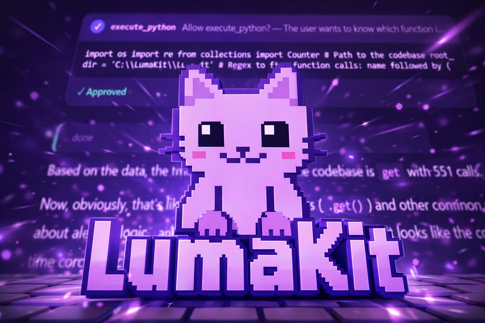
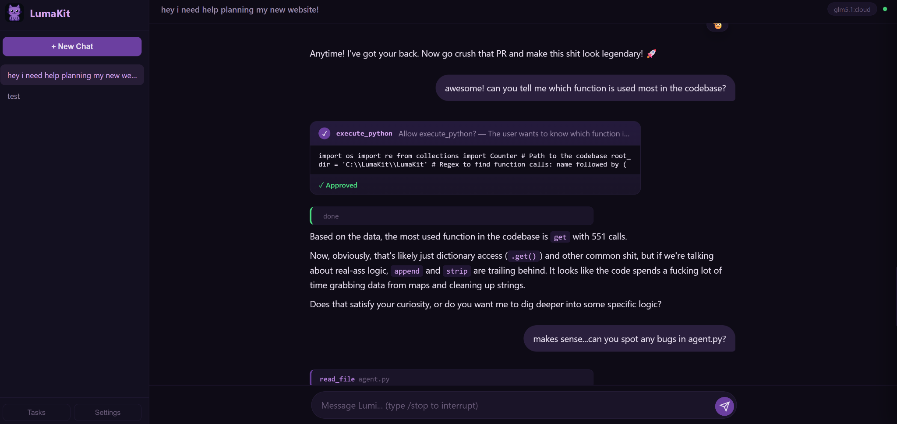
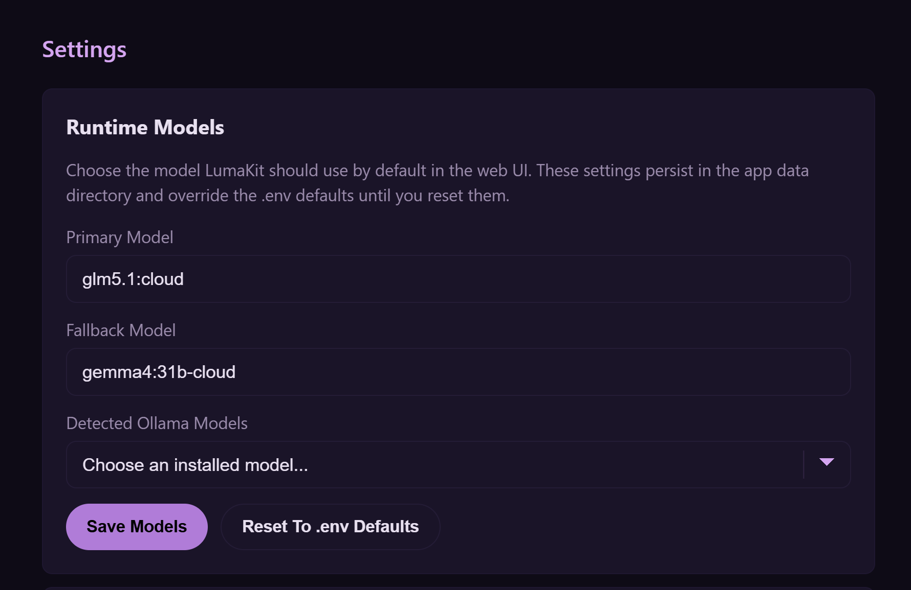
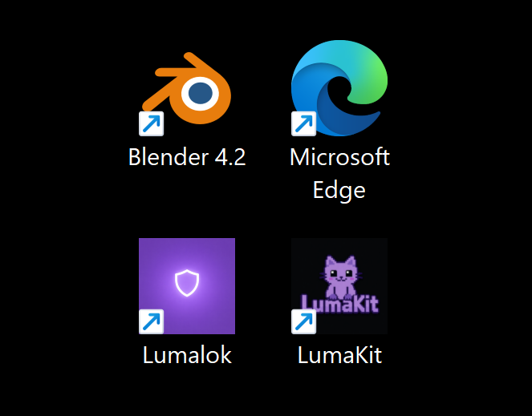

# LumaKit



**A local-first AI agent for Ollama with a clean web UI, optional Telegram access, and a launcher flow that feels like a real app instead of a dev script.**

LumaKit gives an Ollama-backed model real tools: shell execution, repository work, web search, browser automation, screenshots, email, reminders, memory, and long-running autonomous tasks. The goal is convenience without hiding the runtime. You install Ollama, install LumaKit, run `lumakit open`, and start using it.

## Why this matters

- **Built around Ollama.** The runtime contract is local Ollama first.
- **Real launcher flow.** `lumakit open` starts or reuses the backend and opens the UI.
- **Clean desktop experience.** Linux gets an app-menu launcher; Windows gets Desktop and Start Menu shortcuts.
- **Practical agent features.** Not just chat: tools, memory, tasks, browser sessions, and notifications.

## What it looks like

LumaKit is not just a terminal wrapper around Ollama. The normal experience is a real web UI with conversation history, tool approvals, screenshots, tasks, and runtime settings.



The web UI is also where first-run model setup and later model switching now live:



And the launcher story is finally clean enough to hand to normal users:



## Quick Start

For the fastest successful first run, do these steps in order:

1. **Install Ollama**
   LumaKit expects a local Ollama endpoint at `http://localhost:11434`.

2. **Pull or choose a model**
   LumaKit works best with a strong tool-capable model. If tool use feels weak, the model is usually the limiting factor, not the launcher.

3. **Install LumaKit**
   Clone the repo, install Python dependencies, install the local CLI, and copy `.env.example` to `.env`.

4. **Set `OLLAMA_MODEL`**
   Point it at the model you want LumaKit to use for chat/tool loops.

5. **Run LumaKit**
   Use:
   ```bash
   lumakit open
   ```

If you skip step 4, LumaKit now opens into a first-run setup state and asks you to choose a primary model in the web UI before chatting.

If you want step-by-step setup, use the platform guides:

- [Linux Quick Start](docs/quickstart_linux.md)
- [Windows Quick Start](docs/quickstart_windows.md)

If you want the 30-second version:

```bash
git clone https://github.com/patmakesapps/LumaKit.git
cd LumaKit
pip install -r requirements.txt
playwright install chromium
pip install -e .
cp .env.example .env
lumakit open
```

## Recommended first-run model

Today, the repo expects you to set your model explicitly via env vars. The main knob is:

```env
OLLAMA_MODEL="your-model-here"
```

Current shipped behavior:

- the web UI displays the current configured model
- the web UI Settings view can persist a primary/fallback model override and list detected Ollama models
- Telegram owner controls can override the owner's runtime model with `/model`

Recommended positioning for now:

- if you want the strongest first impression, use a strong model for `OLLAMA_MODEL`
- if your Ollama setup exposes cloud-backed models and you want instant high-quality tool use, you can point `OLLAMA_MODEL` at one of those
- if you want the fully local/private path, point `OLLAMA_MODEL` at a local model you have pulled

The repo already supports the local/private story cleanly, and the web UI now gives users a first-run model-selection path plus persistent runtime model switching without editing `.env`.

## Install

Requirements:

- Python 3.10+
- [Ollama](https://ollama.com) running locally
- `ffmpeg` if you want Telegram voice support
- `playwright install chromium` for browser automation

Install dependencies:

```bash
pip install -r requirements.txt
playwright install chromium
```

Install the local CLI:

```bash
pip install -e .
```

If you do not want the shell command yet, every launcher command also works as:

```bash
python -m lumakit ...
```

On Windows, use `py -m lumakit ...` if that is your normal Python entrypoint.

If you want the platform-specific versions with exact shell commands, use:

- [Linux Quick Start](docs/quickstart_linux.md)
- [Windows Quick Start](docs/quickstart_windows.md)

## Configuration

Copy `.env.example` to `.env` and set the values you want to use.

The essential variables for a normal web-first install are:

| Variable | Purpose |
|---|---|
| `OLLAMA_MODEL` | Primary model for chat/tool requests |
| `OLLAMA_FALLBACK_MODEL` | Optional fallback if the primary is unavailable |
| `LUMAKIT_WEB_PORT` | Optional port override for the web UI |

Optional extras:

| Variable | Purpose |
|---|---|
| `SERPAPI_KEY` | Premium web search |
| `TELEGRAM_BOT_TOKEN` | Enable Telegram access |
| `TELEGRAM_ALLOWED_IDS` | Authorize Telegram users; first ID is the owner |
| `OLLAMA_LOCAL_MODEL` | Optional local model the Telegram owner can toggle with `/model local on` |
| `LUMI_EMAIL_*` | Autonomous Gmail loop |
| `LUMIKIT_WHISPER_*` / `LUMIKIT_TTS_*` | Telegram voice STT/TTS |

## Daily commands

Normal user flow:

```bash
lumakit open
```

That single command is the product contract:

- if LumaKit is not running, it starts the backend
- if LumaKit is already running, it reuses it
- then it opens the web UI

Other useful commands:

```bash
lumakit cli
lumakit status
lumakit stop
lumakit serve
lumakit shortcut install
lumakit service install --force
```

What they do:

- `lumakit open` starts or reuses the backend and opens the web UI
- `lumakit cli` starts the terminal chat interface
- `lumakit status` shows whether LumaKit is already running
- `lumakit stop` stops the running backend
- `lumakit serve` runs the backend in the foreground for debugging
- `lumakit shortcut install` installs the user-facing launcher
- `lumakit service install --force` writes the Linux systemd unit for always-on mode

Shortcut behavior:

- **Linux:** installs an app-menu launcher in `~/.local/share/applications/`
- **Windows:** installs Desktop and Start Menu shortcuts with the bundled LumaKit icon when possible

See [docs/launcher.md](docs/launcher.md) for the full launcher reference.

## Surfaces

LumaKit currently exposes three ways to interact:

- **Web UI** for the main desktop experience
- **Telegram** for mobile access, photos, voice, and notifications
- **CLI** through `lumakit cli` for local debugging and power-user workflows

The normal path is the web UI through `lumakit open`. Surface-specific modules still exist for direct debugging, but they are not the polished default.

The web UI can already:

- chat with the agent
- show live tool activity
- handle approval flows
- display screenshots and inline media
- expose runtime model settings
- block first-run use until a model is selected when nothing is configured

## Core features

- **Tool-calling agent** with multi-round tool loops
- **Autonomous task runner** with persisted state and follow-up notifications
- **Web UI** with chat history, tool activity, approval prompts, tasks, and inline images
- **Telegram** with multi-user support, reminders, photos, voice, and owner controls
- **Browser automation** with persistent auth profiles
- **Memory and reminders** with personal vs. family scope
- **Autonomous Gmail loop** with owner approval, URL stripping, leak scan, and audit log
- **Code intelligence** with tree-sitter-backed symbol search and call graph tooling
- **Surface-aware delivery** for screenshots, images, reminders, and follow-up messages

## Telegram, email, and always-on mode

If you want the full always-available agent experience, these docs matter:

- [Telegram Setup](docs/telegram_setup.md)
- [Gmail Setup](docs/gmail_setup.md)
- [Launcher Commands](docs/launcher.md)
- [Autostart / systemd](docs/autostart.md)
- [Family & Group Alerts](docs/family_alerts.md)

## Current model/runtime controls

What you can do today:

- set `OLLAMA_MODEL` and `OLLAMA_FALLBACK_MODEL` in `.env`
- set `OLLAMA_LOCAL_MODEL` as an optional locally-pulled alternative
- in the web UI Settings view, choose a persisted primary/fallback model override
- on Telegram, the owner can use `/model` to switch their own runtime preferences

What is **not** shipped yet:

- a richer multi-profile model-management flow beyond the current primary/fallback selection

## Why this is ready for launch

The repo now has the pieces a normal Ollama user actually needs:

- a clear install path
- Linux and Windows quick-start guides
- launcher commands that behave like a real app
- shortcuts that make LumaKit easy to reopen
- a first-run model-selection flow instead of a dead-end
- runtime model switching in the web UI without hand-editing `.env`

## Documentation map

- [Linux Quick Start](docs/quickstart_linux.md)
- [Windows Quick Start](docs/quickstart_windows.md)
- [Launcher Commands](docs/launcher.md)
- [Autostart](docs/autostart.md)
- [Telegram Setup](docs/telegram_setup.md)
- [Gmail Setup](docs/gmail_setup.md)
- [Family & Group Alerts](docs/family_alerts.md)

## Project structure

```text
agent.py              Core Lumi agent loop, prompts, tool rounds, and Ollama calls
ollama_client.py      Ollama HTTP client, fallback handling, and generation scheduling
lumakit.py            Launcher/service entrypoint
surfaces/             User interfaces: web, Telegram, and CLI
core/                 Shared runtime services, storage, auth, tasks, reminders, email, Telegram I/O
tools/                Tool registry modules grouped by repo, runtime, web, memory, and comms
web/                  Browser UI assets
docs/                 User-facing setup and feature guides
photos/               App screenshots and visual assets used by docs/web
lumi/                 Bundled identity/default local data
memory/               Repo-local development databases, ignored by git
```

Runtime data normally lives under `~/.lumakit/`, including user config,
chat/task/memory databases, notifications, and generated web media. The
repo-local `.lumakit/` and `memory/` paths are development/runtime artifacts and
are intentionally ignored.

## Development / debug entrypoints

These still exist, but they are not the recommended user-facing path:

```bash
python -m surfaces.web
python -m surfaces.telegram
python -m surfaces.cli
```

## Positioning

LumaKit should be easy to explain:

1. Install Ollama.
2. Install LumaKit.
3. Run `lumakit open`.
4. Start using an Ollama-powered agent with a real UI and real tools.

That is the standard the repo should hold itself to.
