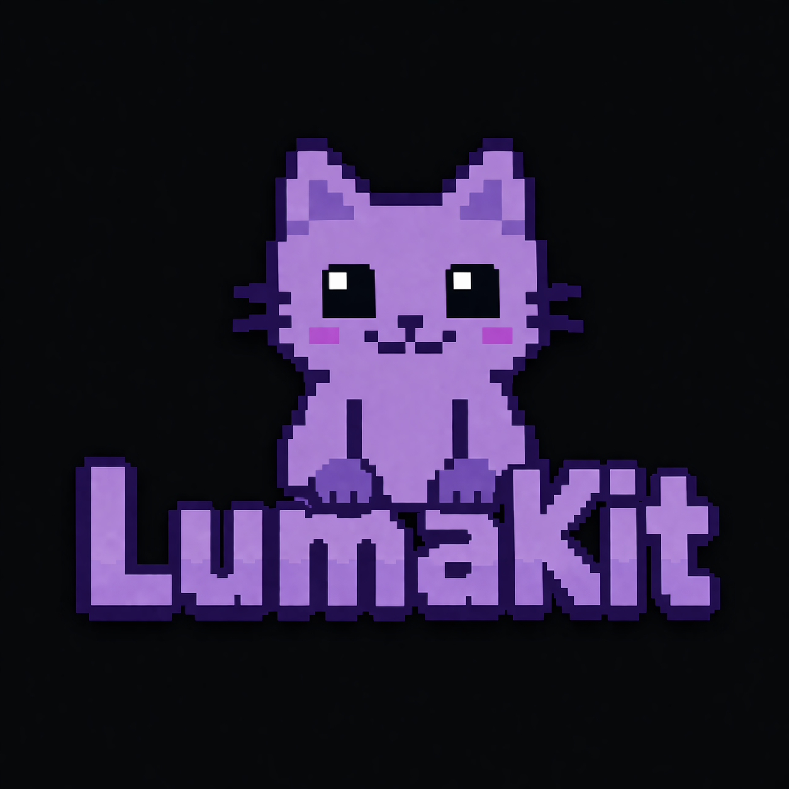

# LumaKit



**A local-first AI agent that runs on your own hardware, powered by [Ollama](https://ollama.com), and controlled from a local web UI or Telegram.**

LumaKit gives a local LLM a full tool suite — repo ops, shell and Python execution, web search, a headless browser with persistent logins, email, screen capture, and more — and can work autonomously in the background while you live your life. Everything stays on your machine. No OpenAI, no Anthropic, no cloud round-trips. Your model, your data, your rules.

The recommended runtime is now a single backend entrypoint: `lumakit serve`. The convenience launcher `lumakit open` starts or reuses that backend and opens the web UI. Standalone surface modules still exist for direct debugging.

---

## Surfaces

LumaKit currently has two user-facing surfaces:

- **Web UI** for local desktop use: chat history, tool approvals, task/settings panels, inline reactions, and inline screenshots/images.
- **Telegram** for mobile/on-the-go use: photos, voice notes, reminders, and long-running tasks that report back in your pocket.

Telegram is still the best mobile surface, but this branch adds real browser-first usage instead of treating web as a thin afterthought.

- **Message from desktop or phone.** Use the local web app when you're at your machine and Telegram when you're away from it.
- **Photos in, photos out.** Drop in an image and ask what it is (vision-capable models only). Ask Lumi to screenshot her progress and she sends it back to the current surface.
- **Voice in, voice out.** Record a voice note and Lumi transcribes it locally via `whisper.cpp`, replies, and optionally reads the reply back as an Edge-TTS voice memo.
- **Household-ready.** Multi-user support with owner/admin controls. Everyone gets their own conversation history, personality overrides, and reminders.
- **Autonomy that reports back.** Kick off a multi-hour task and Lumi pings you when it's blocked, and again when it's done.

## Powered by Ollama

LumaKit talks exclusively to a local Ollama endpoint (`http://localhost:11434` by default). Tool-calling quality is largely a function of your model choice:

- **Opus-class models** (e.g. `qwen3`, `llama3.3`, `gpt-oss`) handle multi-step tool chains reliably.
- **Smaller models** answer basic prompts fine but may stumble on tool argument formatting or long tool loops.
- A `OLLAMA_FALLBACK_MODEL` can be configured so Lumi auto-degrades if the primary is down or overloaded.
- An optional `OLLAMA_LOCAL_MODEL` can be toggled on the fly from Telegram with `/model`.

If a tool seems inconsistent, try a stronger model before assuming the tool is broken.

---

## Features

- **Tool-calling agent** — auto-discovers tools from `tools/` and runs the model in multi-round tool-use loops.
- **Autonomous task runner** — give Lumi a goal and a deadline; she plans, executes, self-evaluates, and reports back. All state persisted in SQLite so tasks survive restarts.
- **Web UI** — browser-based chat surface with saved conversations, tool activity, approval cards with diffs, task/settings views, inline reactions, and inline delivered screenshots/images.
- **Telegram bridge** — mobile-friendly chat surface with multi-user support, photo/vision, voice in/out, admin controls, and reminder/task delivery.
- **CLI interface** — interactive chat with slash commands, clipboard image pasting, chat history, storage management.
- **Autonomous email** — give the agent its own Gmail account; she polls every 60s, drafts replies, and requires one-tap approval before sending. Owner-only, with codebase-leak filtering, rate limiting, and URL stripping. See [docs/gmail_setup.md](docs/gmail_setup.md).
- **Headless browser** — Playwright + Chromium, driven by the model. Form introspection (`inspect_forms`) hands the model real verified selectors so it can fill React/SPA pages without guessing.
- **Persistent browser auth profiles** — log in once to a site (Instagram, Gmail, anything); cookies + localStorage are saved to `~/.lumakit/browser_profiles/<name>.json` and automatically reloaded on subsequent calls. No more re-login every run.
- **Instagram ops** — a thin `instagram_session` tool + self-maintained `instagram/notes.md` (selectors, UI quirks, shortcuts) keep Lumi productive on Instagram across sessions. See [Instagram](#instagram) below.
- **Identity file** — `lumi/identity.txt` stores Lumi's own accounts and credentials; surfaced in the system prompt so she checks it before signing up for anything new and appends new accounts after creating them.
- **Family & personal reminders** — per-user reminders plus household-wide broadcasts. See [docs/family_alerts.md](docs/family_alerts.md).
- **Surface-aware image delivery** — screenshots and existing image files can be sent back to the current surface: inline in the web UI or as Telegram photos.
- **Lightweight reactions** — Lumi can react to user messages; Telegram keeps its native feel and the web UI now shows lightweight reaction pills too.
- **Heartbeat** — background check-ins when the owner has been quiet.
- **Code intelligence** — tree-sitter-backed symbol table for definition lookup, usage search, and call graphs.
- **Memory & reminders** — persistent SQLite memory store and a background reminder thread.
- **Context management** — automatic conversation summarization to keep context lean.
- **Storage budgeting** — tracks local data usage with configurable budgets and cleanup prompts.
- **Faster interrupt handling** — `/stop` now propagates through active model calls and long-running shell/Python work much faster instead of waiting for outer loop boundaries.

---

## Requirements

- Python 3.10+
- [Ollama](https://ollama.com) running locally at `http://localhost:11434` with at least one model pulled
- `ffmpeg` if you plan to work with Telegram audio regularly
- For Telegram speech: a local `whisper.cpp` build plus `edge-tts` installed in the same Python environment

Supported platforms: Linux, macOS, Windows. On Windows, use `py` instead of `python3` in the commands below (e.g. `py -m lumakit serve`).

Install dependencies:

```bash
pip install -r requirements.txt
playwright install chromium
```

Install the local `lumakit` command from this checkout:

```bash
pip install -e .
```

If you do not want to install the CLI yet, every launcher command below also works as `python -m lumakit ...` from the repo root.

For Telegram speech, also build `whisper.cpp` locally and make sure its `base.en` model is downloaded.

## Configuration

Copy `.env.example` to `.env` and set the values you want to use.

| Variable | Purpose |
|---|---|
| `OLLAMA_MODEL` | Primary model for chat requests |
| `OLLAMA_FALLBACK_MODEL` | Fallback model if primary is unavailable |
| `OLLAMA_LOCAL_MODEL` | Optional local model the Telegram owner can switch to with `/model local on` |
| `LUMAKIT_WEB_PORT` | Optional — port for the local web UI, default `7865`. If taken, the launcher walks forward to the next free port automatically. |
| `SERPAPI_KEY` | Optional — enables premium web search |
| `TELEGRAM_BOT_TOKEN` | Bot token from @BotFather (for Telegram bridge) |
| `TELEGRAM_ALLOWED_IDS` | Comma-separated Telegram chat IDs (first = owner/admin) |
| `LUMIKIT_WHISPER_DIR` | Optional — path to the local `whisper.cpp` checkout |
| `LUMIKIT_WHISPER_BIN` | Optional — path to the local `whisper-cli` binary |
| `LUMIKIT_WHISPER_MODEL` | Optional — path to the local Whisper model file |
| `LUMIKIT_TTS_VOICE` | Optional — default Edge voice name, default `en-US-AvaNeural` |
| `LUMIKIT_TTS_FORMAT` | Optional — audio format for Telegram replies, default `mp3` |
| `LUMI_EMAIL_ADDRESS` | Lumi's own Gmail address (for the autonomous email loop) |
| `LUMI_EMAIL_PASSWORD` | Gmail app password (see [docs/gmail_setup.md](docs/gmail_setup.md)) |
| `LUMI_EMAIL_SIGNATURE` | Signature appended to every outbound email |
| `LUMI_EMAIL_MAX_PER_HOUR` | Rate limit on outbound email sends (default 10) |

## Usage

### Recommended Launcher

Start or reuse the backend and open the web UI:

```bash
lumakit open
```

Check status:

```bash
lumakit status
```

Stop the backend:

```bash
lumakit stop
```

Run the backend in the foreground without opening a browser:

```bash
lumakit serve
```

Generate a ready-to-install systemd unit for always-on mode:

```bash
lumakit service install --force
```

Install a desktop/start-menu shortcut that launches the normal UI flow:

```bash
lumakit shortcut install
```

On Linux, this installs the app-menu launcher. On Windows, it creates the normal clickable shortcuts users expect.

For a short command reference, see [docs/launcher.md](docs/launcher.md). For boot persistence, see [docs/autostart.md](docs/autostart.md).

`ollama launch lumakit` is not wired up yet in Ollama itself. The launcher contract on our side is now `lumakit open`; the remaining step is upstream registration in Ollama's launch registry.

### Web UI

```bash
python -m surfaces.web
```

Then open `http://localhost:7865` in your browser, or set `LUMAKIT_WEB_PORT` to use a different port.

The web UI supports:

- saved chats
- tool activity cards
- inline approval prompts with diff review
- `/stop` from the composer
- inline reactions on user messages
- inline delivered screenshots and images

Direct web-surface launches are useful for debugging, but the normal path is `lumakit open` or `lumakit serve`.

### CLI

```bash
python -m surfaces.cli
```

Verbose mode:

```bash
python -m surfaces.cli --verbose
```

CLI commands:

| Command | Action |
|---|---|
| `/p [prompt]` | Paste clipboard image and optionally describe it |
| `/image <path> [prompt]` | Send an image file to the model |
| `/help` | Show all available commands |
| `exit` / `quit` | End the session |

### Telegram Bridge

First-time setup: follow [docs/telegram_setup.md](docs/telegram_setup.md) to create your bot, authorize yourself and your household, and (optionally) wire up local voice STT/TTS.

```bash
python -m surfaces.telegram
```

For normal use, prefer the unified backend launcher or run it as a systemd service (see [docs/autostart.md](docs/autostart.md)).

Telegram commands:

| Command | Action |
|---|---|
| `/help` | Show available commands |
| `/chats` | List and resume saved conversations |
| `/new` | Start a fresh conversation |
| `/stop` | Interrupt Lumi mid-task |
| `/status` | Show model, storage, and index info |
| `/tasks` | List autonomous background tasks |
| `/task <id>` | Show details and history for a specific task |
| `/voice ...` | Enable audio replies, list voices, or set your preferred Edge voice |
| `/adduser` | (Owner only) Authorize a new user |
| `/removeuser` | (Owner only) Remove an authorized user |
| `/model` | (Owner only) Change the owner's primary, fallback, or local-model mode |
| `/personality` | View or change your own Telegram personality override |
| `/users` | (Owner only) List authorized users |

Send photos directly — LumaKit will analyze them if the model supports vision. If local speech is configured, send voice notes or audio files and LumaKit will transcribe them before replying.

### Autonomous Tasks

Tell Lumi a goal with a deadline and she handles the rest:

> *"Research the best dividend ETFs available right now — compare yield, expense ratio, and 1-year return. Report back by tonight."*

> *"Monitor the Bitcoin price every 15 minutes for the next hour and send me updates."*

Lumi will:
1. Generate a step-by-step plan and confirm it with you
2. Execute each step using her full tool suite (web search, browser, code execution, etc.)
3. Self-evaluate after each step and retry or escalate if stuck
4. Ping you on Telegram when blocked and wait for your input
5. Send a final report when done or when the deadline arrives

Use `/tasks` to check status or `/task <id>` for full history. Tasks survive service restarts.

---

## Instagram

Lumi can run a full Instagram account autonomously — posting, engaging, logging growth — while staying within realistic rate limits and IG's unwritten behavioral thresholds.

The `instagram/` folder is **gitignored** (so private playbooks and media don't leak publicly), but you'll likely want to use it:

- **`instagram/plan.md`** — Lumi's playbook. Voice, daily workflow, content pillars, rate caps, hard stops, never-dos. Edit this to tune her behavior.
- **`instagram/notes.md`** — auto-created by the `instagram_session` tool on first use. Self-maintained: Lumi appends working selectors and UI quirks so she doesn't rediscover them every run.
- **`instagram/log.md`** — Lumi's daily activity log, created on first run.
- **`instagram/*.{png,jpg,mp4}`** — drop media here and Lumi will use it for her next post. If the folder is empty, she generates her own content.

Login state lives in `~/.lumakit/browser_profiles/instagram.json` (Playwright `storage_state` — cookies + localStorage). Log in once via `browser_automation` with `auth_profile='instagram'`; all future runs land already authenticated until the session expires. Applies to any site, not just Instagram — use the same mechanism for Gmail, etc.

See [docs/instagram_tips.md](docs/instagram_tips.md) for setup notes and gotchas.

---

## Project Structure

```
agent.py                Core agent loop (tool dispatch, diff preview, confirmation)
ollama_client.py        Ollama HTTP client with fallback and timeout support
tool_registry.py        Auto-discovers and registers tools from tools/

surfaces/
  cli.py                CLI entry point (python -m surfaces.cli)
  telegram.py           Telegram surface — poll loop + session handling
  web.py                Web UI surface — FastAPI app + WebSocket chat

core/
  auth.py               Owner gating (used by email tools)
  chat_store.py         SQLite-backed conversation persistence
  cli.py                Terminal UI helpers (spinner, colors, diffs)
  commands.py           CLI slash-command handler
  diffs.py              Unified diff generation
  email_checker.py      Background IMAP poller + LLM triage + one-shot draft approval
  email_filter.py       URL stripper, codebase-leak scanner, rate limiter, audit log
  heartbeat.py          Periodic owner check-ins when chat has been idle
  interface_context.py  Tracks which surface/user the current run is serving
  interrupts.py         Cooperative cancellation helpers for fast /stop handling
  memory_store.py       SQLite-backed memory/reminder storage
  menu.py               Interactive selection menu
  paths.py              Repo root detection and path resolution
  reminder_checker.py   Background reminder polling thread
  runtime_config.py     Shared per-surface/per-user runtime model configuration
  service.py            LumaKitService — owns background workers + NotificationRouter
  display.py            DisplayHooks — per-surface UI callbacks for the agent
  storage.py            Storage budget tracking
  summarizer.py         Conversation summarization logic
  task_runner.py        Autonomous task execution engine — plan, execute, evaluate, report
  task_store.py         SQLite-backed task persistence (memory/tasks.db)
  telegram_api.py       Raw Telegram Bot API helpers (send, download, poll)
  telegram_commands.py  Telegram slash-command handlers and session/runtime management
  telegram_io.py        Telegram I/O primitives — send_message, TTS dispatch, polling, confirm
  telegram_speech.py    Local STT (whisper.cpp) and TTS (edge-tts) helpers
  telegram_state.py     Global bridge state — sessions, user configs, offset tracker

tools/
  code_intel/           Code index (tree-sitter) — symbol table, parsers, cache
  comms/                Communication tools (telegram, email, reactions, surface-aware image delivery)
  memory/               Memory and reminder tools (save, recall, remind)
  repo/                 File and git operations (read, write, edit, delete, search, diff, git)
  runtime/              Shell, Python, system tools (restart_service, storage, clipboard*)
  web/                  HTTP fetch, web search, headless browser (Playwright), instagram_session

lumi/                   Lumi's private data — gitignored
  identity.txt          Lumi's accounts, credentials, and site logins

instagram/              Lumi's Instagram playbook and activity — gitignored (see above)

web/                    Static assets for the browser UI
  index.html            Web UI shell
  css/                  Styling
  js/                   WebSocket app + client logic

~/.lumakit/             Persistent per-user data (outside the repo)
  browser_profiles/     Playwright storage_state files for persistent logins
  web_media/            Staged images/screenshots served inline to the web UI
```

*Clipboard tools require a display and are not available in headless/server mode.*

## Adding Tools

Tools are auto-registered from `tools/**/*.py`. To add a new tool, follow the guidance in [CONTRIBUTING.md](CONTRIBUTING.md).

## Git Workflow

- Branch from `main` for each discrete task
- Prefer short-lived branches such as `feat/add-web-tool` or `fix/tool-registry-validation`
- Keep `main` stable and merge completed work back into `main`
- If your branch gets behind, merge `main` into your branch instead of rebasing

## Troubleshooting

**Web UI won't load on Windows / "ERR_INVALID_HTTP_RESPONSE"**
Another process is squatting the default port (a common culprit is `NTKDaemon` from Nahimic audio on MSI/Realtek laptops). As of the latest release, `lumakit serve` detects this and falls back to the next free port automatically — watch for a line like `Port 7865 is in use — falling back to 7866` at startup, and note the URL in the "Web UI:" line that follows. To pin a specific port, set `LUMAKIT_WEB_PORT` in `.env` or `~/.lumakit/config.env`.

**`lumakit status` says `unhealthy`**
A process is alive but the web server didn't bind. Run `lumakit stop` to clear the stale runtime state, then `lumakit serve` and check the startup output for errors.
