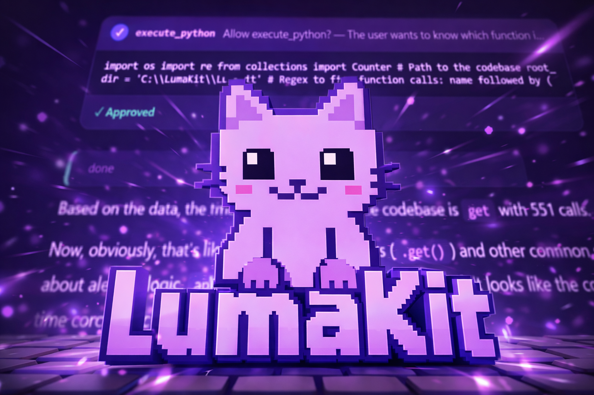
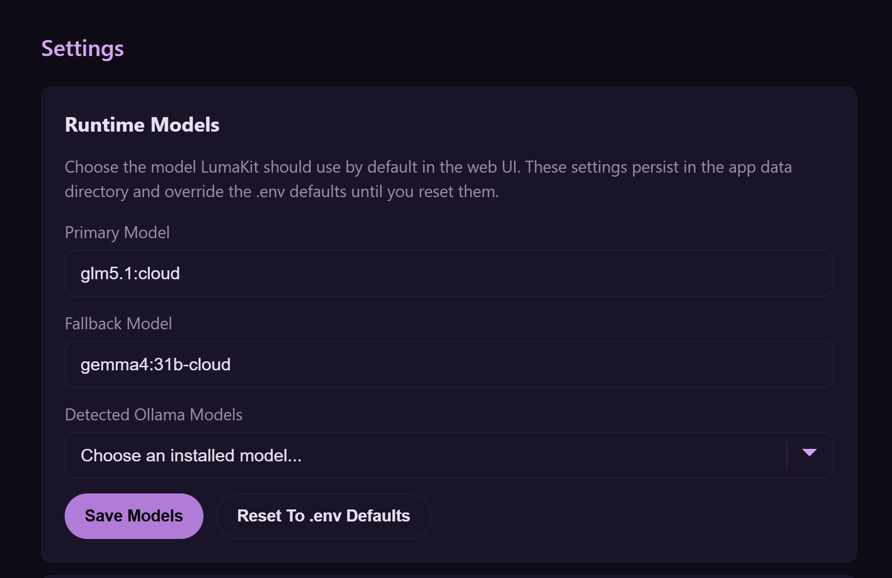
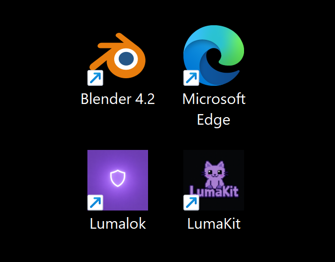

# LumaKit



[](https://github.com/patmakesapps/LumaKit/actions/workflows/ci.yml)

**The self-hosted autonomous task agent you can actually trust with a shell — and now with a body.** Delegate a job from your desk, watch it work in a real UI, approve the risky steps, and get pinged when it's done. Runs on Claude, GPT, Grok — or fully local Ollama when privacy matters.

<!-- LAUNCH GIF (pre-launch checklist §8.2): record per docs/demo-script.md, export ≤10 MB,
     save as photos/lumakit_flagship_demo.gif, then uncomment:
<p align="center">
  
</p>
-->

LumaKit gives a model real tools: shell execution, repository work, web search, browser automation, screenshots, email, reminders, memory, and long-running autonomous tasks that survive restarts. Not another chat assistant — a task agent: you hand Lumi a job, it runs it start to finish, and it reports back.

And LumaKit doesn't stop at the desk. It is the mind of the **VISITOR LX-1
Builders Edition** robot ([lumalien.com](https://lumalien.com)): the same
agent that fixes your repo can roll through your home, look through a real
camera and describe what it actually sees, and remember the rooms, objects,
and routines it finds — while every safety-critical reflex runs on the robot
itself, never on the model. The robot's onboard stack is open source too:
[LumaBot](https://github.com/patmakesapps/LumaBot). One agent, from your
terminal to your living room floor.

## Why this matters

- **Durable autonomous tasks.** A persistent task runner drives jobs for hours or days, keeps its own todo list, survives restarts, and refuses to fake completion.
- **Real observability.** A web UI that shows live tool activity, diff previews before writes, approval prompts, and screenshots — you *watch it work*, not just chat with it.
- **Safe autonomy.** Token-gated server, filesystem sandbox, fail-closed confirmations, and approvals on shell/git/delete that can't be toggled away — a background task that hits a risky step pauses and asks your phone. See [Security model](#security-model).
- **Bring any model.** One config switch between Anthropic (Claude), OpenAI (GPT), xAI (Grok), and local Ollama — local stays the privacy option, not a requirement.
- **A body, not just a shell.** Pair LumaKit with the VISITOR LX-1 and the agent gains wheels, a camera it can genuinely see through, and a memory of your home — with a no-LLM remote mode and a hard STOP always one tap away.
- **Real launcher flow.** `lumakit open` starts or reuses the backend and opens the UI; Linux gets an app-menu launcher, Windows gets Desktop/Start Menu shortcuts.

## What it looks like

LumaKit is not just a terminal wrapper around Ollama. The normal experience is a real web UI with conversation history, tool approvals, screenshots, tasks, and runtime settings.


The web UI is also where first-run model setup and later model switching now live:



And the launcher story is finally clean enough to hand to normal users:



## Quick Start

For the fastest successful first run, do these steps in order:

1. **Install LumaKit**
   Clone the repo, install Python dependencies, install the local CLI, and copy `.env.example` to `.env`.

2. **Pick a model provider**
   Bring an API key for a hosted model, or run fully local — either works with the same config:
   ```env
   # Hosted (best first-run tool quality — no Ollama needed):
   LLM_PROVIDER="anthropic"        # or "openai" / "xai"
   LLM_MODEL="claude-opus-4-8"     # or "gpt-5.2" / "grok-4"
   LLM_API_KEY="your-key-here"

   # Or fully local/private (requires Ollama at localhost:11434):
   OLLAMA_MODEL="your-pulled-model"
   ```
   You can also pick the provider and paste the key later in the web UI Settings — it's stored server-side and never shown again.

3. **Run LumaKit**
   ```bash
   lumakit open
   ```

If you skip step 2, LumaKit opens into a first-run setup state and asks you to choose a provider and model in the web UI before chatting.

If you want step-by-step setup, use the platform guides:

- [Linux Quick Start](docs/quickstart_linux.md)
- [Windows Quick Start](docs/quickstart_windows.md)

If you want the 30-second version:

```bash
git clone https://github.com/patmakesapps/LumaKit.git
cd LumaKit
pip install -r requirements.txt
pip install -e ".[all]"        # or plain `pip install -e .` for the core-only install
playwright install chromium    # only needed for browser automation
cp .env.example .env
lumakit open
```

## Give Lumi a body: LumaBot / VISITOR LX-1

LumaKit can drive a physical robot — the **VISITOR LX-1 Builders Edition**
(available at [lumalien.com](https://lumalien.com)), known as LumaBot
throughout the code. The robot runs a separate open-source hardware daemon —
[patmakesapps/LumaBot](https://github.com/patmakesapps/LumaBot) — that owns
all safety-critical behavior (obstacle stops, watchdog timeouts, collision
recovery), so driving never depends on Wi-Fi or a model response.

Three modes, switchable from the web UI top bar or `/lumabot` on Telegram:

- **Off** — the full LumaKit agent, no robot tools.
- **Agent** — a focused robot profile: Lumi interprets natural language and
  drives through structured, watchdog-leased motion tools. It can also use
  the camera (`lumabot_capture_photo` takes a real photo and looks at it) and
  the memory tools, so the robot can remember rooms, objects, and routines it
  observes.
- **Remote** — a no-LLM D-pad: direct structured commands with zero model
  involvement, plus a red STOP that also aborts any in-flight agent turn.

Camera photos live in a private per-user library that self-prunes to the
newest 20 (configurable with `LUMABOT_PHOTO_KEEP`), so captures can never eat
the robot's storage. Capturing is owner-only, and robot motion, autonomy,
power, and camera tools are all denied to non-owner Telegram users.

Setup guide: [LumaBot on a Raspberry Pi](docs/lumabot_pi_setup.md).

## Connect Struqt

LumaKit can connect to [Struqt](https://www.struqt.live), the desktop project TODO manager, through Struqt's local API. Struqt must be open on the same machine.

1. Open Struqt.
2. Click **LumaKit** in Struqt's title bar.
3. Enable the local API.
4. Open LumaKit with `lumakit open`.
5. Ask LumaKit: `is Struqt connected?`

After the connection is active, you can ask LumaKit to list Struqt projects, create projects, create tasks, or update tasks. For example:

```text
show my Struqt projects
create a Struqt task called "Review launch checklist" in Launch
```

Note: Struqt is managed by Utility Tech LLC. The Struqt-side release that enables this integration has not shipped publicly yet, but support is planned.

## Bring any model

LumaKit speaks to four providers behind one interface — pick with `LLM_PROVIDER`:

| Provider | `LLM_PROVIDER` | Example `LLM_MODEL` | Key variable |
|---|---|---|---|
| Anthropic (Claude) | `anthropic` | `claude-opus-4-8` | `LLM_API_KEY` or `ANTHROPIC_API_KEY` |
| OpenAI (GPT) | `openai` | `gpt-5.2` | `LLM_API_KEY` or `OPENAI_API_KEY` |
| xAI (Grok) | `xai` | `grok-4` | `LLM_API_KEY` or `XAI_API_KEY` |
| Ollama (local) | `ollama` (default) | any pulled model | none |

How to choose:

- **Strongest first impression:** a hosted frontier model (Claude/GPT/Grok) gives instant high-quality tool use with zero local setup.
- **Fully local/private:** run Ollama and point `OLLAMA_MODEL` at a pulled model — nothing leaves your machine. The old `OLLAMA_*` variables keep working unchanged.
- **Switch anytime, no restart:** the Settings provider card picks the provider, the model (remembered *per provider* — your Claude choice survives a week on Grok), an optional fallback, and the API key (stored server-side, never echoed back). Changes apply to the next message and the next task round immediately. On Ollama the model field autocompletes from your pulled models. Telegram owners can still override their runtime model with `/model`.

## Install

Requirements:

- Python 3.10+
- An API key for Claude/GPT/Grok, **or** [Ollama](https://ollama.com) running locally
- `ffmpeg` if you want Telegram voice support
- `playwright install chromium` for browser automation

Install dependencies:

```bash
pip install -r requirements.txt      # core: web UI + agent + all four providers
```

Optional stacks (skip what you don't need — the agent degrades gracefully):

```bash
pip install -e ".[browser]"          # browser automation (then: playwright install chromium)
pip install -e ".[desktop]"          # desktop screenshots + clipboard tools
pip install -e ".[speech]"           # Telegram voice replies
pip install -e ".[all]"              # everything
```

Install the local CLI:

```bash
pip install -e .
```

If you do not want the shell command yet, every launcher command also works as:

```bash
python -m lumakit ...
```

On Windows, use `py -m lumakit ...` if that is your normal Python entrypoint.

If you want the platform-specific versions with exact shell commands, use:

- [Linux Quick Start](docs/quickstart_linux.md)
- [Windows Quick Start](docs/quickstart_windows.md)

## Configuration

Copy `.env.example` to `.env` and set the values you want to use.

The essential variables for a normal web-first install are:

| Variable | Purpose |
|---|---|
| `LLM_PROVIDER` | `ollama` (default) \| `anthropic` \| `openai` \| `xai` |
| `LLM_MODEL` | Primary model for chat/tool requests |
| `LLM_FALLBACK_MODEL` | Optional fallback if the primary is unavailable |
| `LLM_API_KEY` | API key for hosted providers |
| `OLLAMA_MODEL` / `OLLAMA_FALLBACK_MODEL` | Ollama-specific aliases; still fully supported |
| `LUMAKIT_WEB_PORT` | Optional port override for the web UI |

Security & network (see [Security model](#security-model)):

| Variable | Purpose |
|---|---|
| `LUMAKIT_BIND_HOST` | Bind host; defaults to `127.0.0.1` (local-only) |
| `LUMAKIT_ALLOWED_ORIGINS` | Extra hostnames allowed on WebSocket upgrades when exposed |
| `LUMAKIT_ALLOW_PATHS` | Opt-in extra directories file tools may touch outside the workspace |

Optional extras:

| Variable | Purpose |
|---|---|
| `LUMAKIT_TASK_TRACES` | Set to `0` to stop writing per-task execution traces to `~/.lumakit/traces/` |
| `LUMAKIT_TRACE_RETENTION_DAYS` | Days to keep task traces before they are pruned (default `30`) |
| `SERPAPI_KEY` | Premium web search |
| `TELEGRAM_BOT_TOKEN` | Enable Telegram access |
| `TELEGRAM_ALLOWED_IDS` | Authorize Telegram users; first ID is the owner, others get scoped roles |
| `OLLAMA_LOCAL_MODEL` | Optional local model the Telegram owner can toggle with `/model local on` |
| `LUMI_EMAIL_*` | Autonomous Gmail loop |
| `LUMIKIT_WHISPER_*` / `LUMIKIT_TTS_*` | Telegram voice STT/TTS |

## Daily commands

Normal user flow:

```bash
lumakit open
```

That single command is the product contract:

- if LumaKit is not running, it starts the backend
- if LumaKit is already running, it reuses it
- then it opens the web UI

Other useful commands:

```bash
lumakit cli
lumakit status
lumakit stop
lumakit serve
lumakit shortcut install
lumakit service install --force
```

What they do:

- `lumakit open` starts or reuses the backend and opens the web UI
- `lumakit cli` starts the terminal chat interface
- `lumakit status` shows whether LumaKit is already running
- `lumakit stop` stops the running backend
- `lumakit trace [task_id]` lists autonomous task traces, or prints one task's round-by-round record (`--json` for the raw events)
- `lumakit serve` runs the backend in the foreground for debugging
- `lumakit shortcut install` installs the user-facing launcher
- `lumakit service install --force` writes the Linux systemd unit for always-on mode

Shortcut behavior:

- **Linux:** installs an app-menu launcher in `~/.local/share/applications/`
- **Windows:** installs Desktop and Start Menu shortcuts with the bundled LumaKit icon when possible

See [docs/launcher.md](docs/launcher.md) for the full launcher reference.

## Surfaces

LumaKit currently exposes three ways to interact:

- **Web UI** for the main desktop experience
- **Telegram** for mobile access, photos, voice, and notifications
- **CLI** through `lumakit cli` for local debugging and power-user workflows

The normal path is the web UI through `lumakit open`. Surface-specific modules still exist for direct debugging, but they are not the polished default.

The web UI can already:

- chat with the agent
- show live tool activity
- handle approval flows, including approving/denying a paused background task
- display screenshots and inline media
- pick the provider and model (per-provider memory, applied live — no restart)
- detect when `.env` was edited after startup and restart the backend in one click
- block first-run use until a model is selected when nothing is configured
- switch LumaBot modes (Off / Agent / Remote), drive with the Remote D-pad, and
  emergency-stop the robot

## Core features

- **Tool-calling agent** with multi-round tool loops
- **Multi-provider model layer** — Claude, GPT, Grok, or local Ollama behind one interface, hot-swappable from Settings
- **Autonomous task runner** with durable persisted state (WAL SQLite, append-only history) — tasks survive backend restarts and resume with full context
- **Cross-surface task approvals** — a background task that hits a protected action (shell, git write, delete) pauses and pings you; approve or deny from Telegram (`/approve N`) or the web task panel, and approval grants exactly that action, once
- **Shareable task pages** — every task gets a token-gated `/task/<id>` page with status, result, files changed, todo list, and the full activity timeline; completion pings link to it
- **Web UI** with chat history, tool activity, approval prompts, tasks, and inline images
- **Telegram** with multi-user support, reminders, photos, voice, and owner controls
- **Browser automation** with persistent auth profiles
- **Memory and reminders** with personal vs. family scope
- **Physical robot control** for the VISITOR LX-1 (LumaBot): watchdog-leased
  motion, camera capture the model can actually look at, a self-pruning photo
  library, and a no-LLM remote mode with a hard STOP
- **Autonomous Gmail loop** with owner approval, URL stripping, leak scan, and audit log
- **Code intelligence** with tree-sitter-backed symbol search and call graph tooling
- **Surface-aware delivery** for screenshots, images, reminders, and follow-up messages

## Security model

LumaKit gives a model real tools — including a shell — so its security posture is explicit:

- **Local-only by default.** The web server binds `127.0.0.1`. Exposing it to your network is
  an explicit opt-in (`LUMAKIT_BIND_HOST`), and even then every request still authenticates.
- **Token-gated API.** A random per-install session token (stored in
  `~/.lumakit/web_session_token`) is required on every `/api/*` request and WebSocket
  handshake. `lumakit open` injects it into your browser automatically; anything without it
  gets a 401. WebSocket upgrades also enforce an Origin allowlist against DNS-rebinding.
- **Filesystem sandbox.** File tools are contained to the active workspace. Secrets paths
  (`.env`, `config.env`, `~/.lumakit/**`, `.git/config`) are never readable by tools, even
  inside the workspace. Power users can widen access with `LUMAKIT_ALLOW_PATHS`.
- **Approvals with a floor.** While safe mode is on (the default), shell, Python execution,
  file deletion, and git writes always prompt for approval — even if you turn the general
  approvals setting off — and the confirm flow fails closed: a missing or timed-out
  confirmation is a denial. The owner can explicitly drop this floor with `/safemode off`
  (owner-only, Telegram or Settings), which also opens the filesystem sandbox for the owner;
  secrets files stay blocked and other users keep their limits regardless.
- **Autonomous tasks have the same floor.** A background task that reaches a protected action
  pauses and asks you (Telegram or web) instead of running it. Approval mints a one-shot grant
  for exactly that command, with a 60-minute expiry; denial resumes the task with
  do-not-retry guidance. Every request and grant lands in the task's audit timeline.
- **Per-user roles on Telegram.** Only the owner can reach execution/repo-write tools; other
  authorized users get `trusted` or `limited` roles (managed with `/role`).
- **Honest tool descriptions.** `execute_python` says exactly what it is: not sandboxed, runs
  as the local user, always behind approval.

To expose LumaKit beyond localhost, set `LUMAKIT_BIND_HOST`, add your hostnames to
`LUMAKIT_ALLOWED_ORIGINS`, and treat the session token like a password.

## Telegram, email, and always-on mode

If you want the full always-available agent experience, these docs matter:

- [Telegram Setup](docs/telegram_setup.md)
- [Gmail Setup](docs/gmail_setup.md)
- [Launcher Commands](docs/launcher.md)
- [Autostart / systemd](docs/autostart.md)
- [Family & Group Alerts](docs/family_alerts.md)
- [LumaBot on a Raspberry Pi](docs/lumabot_pi_setup.md)

## Current model/runtime controls

What you can do today:

- pick a provider (`ollama`/`anthropic`/`openai`/`xai`) via `.env` or the Settings provider card
- pick a model per provider in Settings — remembered separately for each provider, applied to
  the next message and task round with no restart; leave it blank for the provider's default
- set an optional per-provider fallback model, retried automatically if the primary fails
- paste an API key in Settings — stored server-side only, never echoed back; keys already in
  `.env` are detected automatically
- set `LLM_MODEL`/`LLM_FALLBACK_MODEL` in `.env` as global defaults (or the classic `OLLAMA_*`
  variables for local)
- set `OLLAMA_LOCAL_MODEL` as an optional locally-pulled alternative
- on Telegram, the owner can use `/model` to switch their own runtime preferences
- if you edit `.env` while LumaKit is running, Settings shows a "Restart needed" banner naming
  the changed variables, with a one-click **Restart Backend** button

What is **not** shipped yet:

- standing approvals for autonomous tasks ("allow git commits for the rest of this task"
  instead of approving each one) — planned; today every protected action is approved
  individually
- model-id validation on save — a typo'd model name fails on the next message, not at save time

## Why this is ready for launch

The repo now has the pieces a real install actually needs:

- a clear install path with hosted-key **or** fully-local first run
- Linux and Windows quick-start guides
- launcher commands that behave like a real app, plus reopenable shortcuts
- a first-run provider/model-selection flow instead of a dead-end
- a hardened security posture: token-gated server, filesystem sandbox, fail-closed approvals
- a durable task runner backed by WAL SQLite and append-only history, with a cross-surface
  approval loop and shareable task pages
- a test suite and CI on every push

## Documentation map

- [Linux Quick Start](docs/quickstart_linux.md)
- [Windows Quick Start](docs/quickstart_windows.md)
- [Launcher Commands](docs/launcher.md)
- [Autostart](docs/autostart.md)
- [Telegram Setup](docs/telegram_setup.md)
- [Gmail Setup](docs/gmail_setup.md)
- [Family & Group Alerts](docs/family_alerts.md)
- [LumaBot on a Raspberry Pi](docs/lumabot_pi_setup.md)
- [LumaBot repository](https://github.com/patmakesapps/LumaBot) — the robot's onboard daemon
- [LumaKit vs OpenClaw](docs/vs-openclaw.md)

## Connect to Lumalok

LumaKit includes tools for [Lumalok](https://github.com/patmakesapps/Lumalok), a local encrypted secrets manager. After Lumalok is running and unlocked, Lumi can connect to its local-only API to create projects, add secrets, list secret metadata, and check expiring secrets.

1. Install and open Lumalok.
2. Unlock your Lumalok vault.
3. In Lumalok, open **Settings** and enable **LumaKit Integration**.
4. In LumaKit, ask Lumi to connect to Lumalok.

Lumalok stores the local API token at `~/.lumalok/integration.json`. Secret values are not returned by default; Lumi should reveal raw values only when explicitly requested.

## Project structure

```text
agent.py              Core Lumi agent loop, prompts, tool rounds, and model calls
ollama_client.py      Native Ollama client with local generation scheduling
lumakit.py            Launcher/service entrypoint
tool_registry.py      Central tool registration, validation, and dispatch
lumakit.service.example
                      Example systemd unit for always-on Linux installs
surfaces/             User interfaces: web, Telegram, and CLI
core/                 Shared runtime services: providers, auth, tasks, storage, approvals
core/providers/       Model provider adapters (Ollama, Anthropic, OpenAI, xAI)
tools/                Tool registry modules grouped by repo, runtime, web, memory, comms,
                      code_intel, lumabot (robot), lumalok, and struqt
tests/                Pytest suite (security policy, sandbox, providers, durability)
web/                  Browser UI assets
docs/                 User-facing setup and feature guides
photos/               App screenshots and visual assets used by docs/web
internal/             Internal packaging and launcher support files
.github/              GitHub metadata, CI workflow, and repository automation
```

Runtime data normally lives under `~/.lumakit/`, including user config,
chat/task/memory databases, notifications, and generated web media. The
repo-local `.lumakit/` and other generated runtime artifacts are intentionally
ignored.

## Development / debug entrypoints

These still exist, but they are not the recommended user-facing path:

```bash
python -m surfaces.web
python -m surfaces.telegram
python -m surfaces.cli
```

## Positioning

LumaKit should be easy to explain:

1. Install LumaKit.
2. Bring a model — an API key for Claude/GPT/Grok, or local Ollama for full privacy.
3. Run `lumakit open`.
4. Delegate a job, watch it work, approve the risky steps, get pinged when it's done.

Chat assistants answer you. LumaKit does the job. That is the standard the repo should hold itself to.
